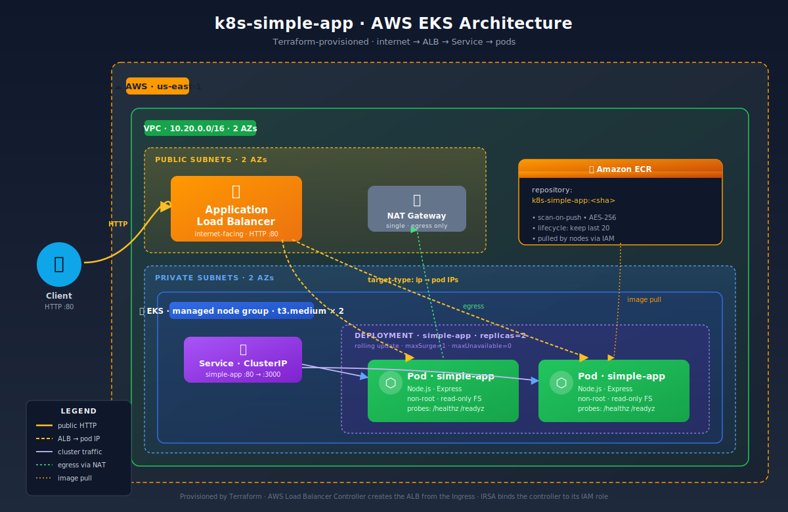
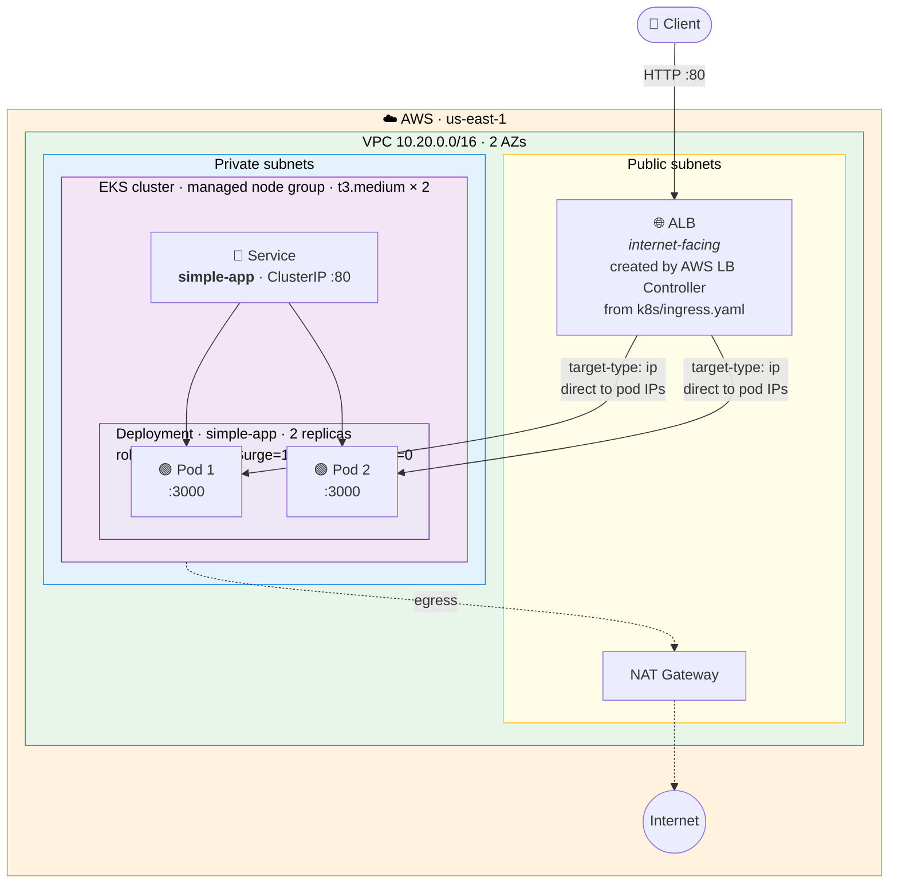
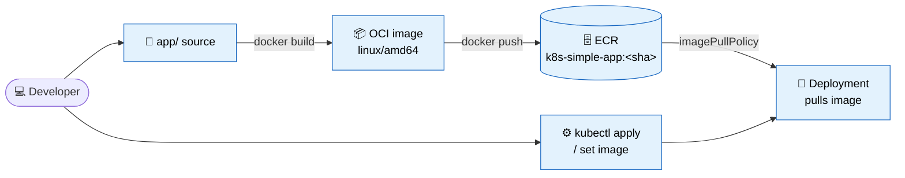

# k8s-simple-app

<p align="center">
  
</p>

A Node.js REST API deployed to Amazon EKS as a hands on practice project. The
goal is pedagogical: every cloud, cluster, and workload primitive is visible
and annotated, so you can trace a request end-to-end from the public ALB,
through the Service, into a pod, and out to a response.

- **Infrastructure** — VPC, EKS, ECR, IRSA, and the AWS Load Balancer
  Controller are provisioned with [**Terraform**](terraform/).
- **Application** — an [Express REST API](app/src/server.js) packaged with a
  multi-stage [Dockerfile](app/Dockerfile) for a small, non-root runtime image.
- **Workload** — deployed with raw [Kubernetes manifests](k8s/) (no Helm, no
  Kustomize) so every field probes, resource limits, security context, ALB
  annotations is explicit.

## Table of contents

- [What you practice](#what-you-practice)
- [Architecture](#architecture)
- [Repository layout](#repository-layout)
- [Prerequisites](#prerequisites)
- [The application](#the-application)
- [Kubernetes manifests](#kubernetes-manifests)
- [Terraform resources](#terraform-resources)
- [Step 1 — Provision infrastructure](#step-1--provision-infrastructure)
- [Step 2 — Build and push the image to ECR](#step-2--build-and-push-the-image-to-ecr)
- [Step 3 — Update the Deployment image and apply manifests](#step-3--update-the-deployment-image-and-apply-manifests)
- [Step 4 — Reach the API](#step-4--reach-the-api)
- [Configuration reference](#configuration-reference)
- [Operations](#operations)
- [Production hardening notes](#production-hardening-notes)

## What you practice

- Creating an EKS cluster with Terraform (VPC + managed node group + addons)
- Building and pushing a multi-arch-aware container image to ECR
- Deployments with resource requests/limits and zero-downtime rolling updates
- ConfigMaps for environment configuration and Secrets for credentials
- ClusterIP Service for in-cluster traffic
- Ingress backed by an ALB via the AWS Load Balancer Controller (IRSA-powered)
- Liveness, readiness, and startup probes, wired to real HTTP endpoints
- Pod `securityContext`: non-root, read-only root filesystem, dropped
  capabilities, seccomp `RuntimeDefault`
- `kubectl` debugging workflows: `logs`, `describe`, `exec`, `port-forward`,
  `get events`
- Clean teardown without orphaning AWS Load Balancer resources

## Architecture

### Request path (runtime)



### Image delivery (build time)



## Repository layout

```
k8s-simple-app/
├── app/                        # Node.js Express app
│   ├── .dockerignore
│   ├── Dockerfile              # multi-stage: deps → runtime, non-root user
│   ├── package.json            # single dep: express
│   └── src/
│       └── server.js           # HTTP handlers + liveness/readiness + graceful shutdown
├── k8s/                        # Kubernetes manifests, applied in this order
│   ├── namespace.yaml          # simple-app namespace
│   ├── configmap.yaml          # non-secret env vars
│   ├── secret.yaml             # demo-only base64 "credentials"
│   ├── deployment.yaml         # pod spec, probes, securityContext, resources
│   ├── service.yaml            # ClusterIP fronting the pods
│   └── ingress.yaml            # ALB ingress with healthcheck annotations
├── terraform/                  # AWS infrastructure
│   ├── versions.tf             # providers + (commented) S3 backend
│   ├── providers.tf            # AWS, Kubernetes, Helm providers
│   ├── variables.tf            # region, CIDRs, node group sizing, etc.
│   ├── outputs.tf              # ECR URL, kubeconfig command, cluster info
│   ├── vpc.tf                  # VPC module with ALB-discovery subnet tags
│   ├── eks.tf                  # EKS cluster + managed node group + addons
│   ├── ecr.tf                  # ECR repo + lifecycle policy (keep last 20)
│   └── alb_controller.tf       # IAM policy + IRSA + Helm release
└── README.md
```

## Prerequisites

- **AWS** — an account with permissions to create VPC, EKS, IAM, and ECR
  resources. `aws sts get-caller-identity` should succeed.
- **Tools** —
  - `terraform` ≥ 1.6
  - `awscli` v2
  - `kubectl` (version compatible with the cluster version: default is 1.30)
  - `docker` (with buildx if you're on Apple Silicon)
  - `helm` (optional — only needed if you want to inspect the ALB controller
    release: `helm -n kube-system list`)
- **Region** — defaults to `us-east-1`. Override by editing `variables.tf` or
  with `-var region=...`.
- **Budget awareness** — a running EKS cluster + NAT gateway + ALB is not
  free. Destroy when you're done practicing.

## The application

Source: [app/src/server.js](app/src/server.js)

A minimal Express server that exposes:

| Method | Path         | Purpose                                                                 |
|--------|--------------|-------------------------------------------------------------------------|
| GET    | `/`          | Returns `{ message, env, hostname }` — hostname proves which pod served |
| GET    | `/api/items` | Returns a tiny hard-coded list plus the resolved `DB_USER` (masked)     |
| GET    | `/healthz`   | Liveness endpoint — always `200` once the process is up                 |
| GET    | `/readyz`    | Readiness endpoint — returns `503` for the first 3s after boot, then `200` |

Environment variables consumed by the app (all have safe fallbacks for local
runs):

| Var           | Source             | Default         | Description                             |
|---------------|--------------------|-----------------|-----------------------------------------|
| `PORT`        | ConfigMap          | `3000`          | Listen port                             |
| `APP_NAME`    | ConfigMap          | `k8s-simple-app`| Returned by `/`                         |
| `APP_ENV`     | ConfigMap          | `development`   | Returned by `/`                         |
| `LOG_LEVEL`   | ConfigMap          | `info`          | (Reserved — not wired to a logger yet)  |
| `DB_USER`     | Secret             | `unset`         | Echoed by `/api/items`                  |
| `DB_PASSWORD` | Secret             | `unset`         | Presence detected; value masked as `***`|

Graceful shutdown: `SIGTERM`/`SIGINT` stop accepting new connections and drain
in-flight requests before exiting. This pairs with the Deployment's
`terminationGracePeriodSeconds: 30` so rolling updates don't cut connections.

### Dockerfile notes

[app/Dockerfile](app/Dockerfile) is a two-stage build:

1. **deps** — installs production dependencies in a clean layer.
2. **runtime** — copies only `node_modules` and `src/` onto a fresh
   `node:20-alpine`, drops to a non-root `app` user, and sets a
   `HEALTHCHECK` that hits `/healthz` so Docker/ECS engines see the container
   as unhealthy if the endpoint stops responding. Kubernetes ignores this
   `HEALTHCHECK` and relies on its own probes, but it remains useful for
   local `docker run` tests.

## Kubernetes manifests

All live in [k8s/](k8s/) and target the `simple-app` namespace.

### [namespace.yaml](k8s/namespace.yaml)

Creates the `simple-app` namespace. Kept separate so it can be applied first;
every other manifest references it explicitly.

### [configmap.yaml](k8s/configmap.yaml)

Non-secret app config (`APP_NAME`, `APP_ENV`, `PORT`, `LOG_LEVEL`). Injected
into the container via `envFrom.configMapRef` in the Deployment.

### [secret.yaml](k8s/secret.yaml)

Demo Secret holding `DB_USER` / `DB_PASSWORD` as base64. **Do not put real
secrets here and do not commit real credentials.** In production, replace
this file with an External Secrets Operator `ExternalSecret` or the AWS
Secrets and Configuration Provider (ASCP) for the Secrets Store CSI Driver.

### [deployment.yaml](k8s/deployment.yaml)

The main workload spec. Highlights:

- **Replicas** — 2, with `maxSurge=1 / maxUnavailable=0` so rolling updates
  keep at least the current capacity serving traffic.
- **Probes** — three probes, all HTTP:
  - `startupProbe` — 30 × 2s (60s grace) before liveness kicks in.
  - `livenessProbe` — `/healthz` every 15s; 3 failures restart the container.
  - `readinessProbe` — `/readyz` every 5s; failure removes the pod from
    the Service endpoints without killing it.
- **Resources** — `requests: 100m CPU / 128Mi mem`, `limits: 500m / 256Mi`.
  Requests drive scheduling; limits cap runaway memory (OOMKill) and throttle
  CPU.
- **Security context** — runs as uid/gid 1000, `runAsNonRoot: true`,
  `readOnlyRootFilesystem: true`, drops **ALL** capabilities,
  `allowPrivilegeEscalation: false`, seccomp `RuntimeDefault`. An
  `emptyDir` is mounted at `/tmp` to cover libraries that need scratch space.
- **`automountServiceAccountToken: false`** — the app doesn't talk to the
  Kubernetes API, so no token is needed.
- **`terminationGracePeriodSeconds: 30`** — gives the Node process time to
  drain on `SIGTERM`.
- **Image placeholder** — line 35 is
  `ACCOUNT_ID.dkr.ecr.REGION.amazonaws.com/k8s-simple-app:latest`. Step 3
  below replaces it with the real ECR URL from Terraform.

### [service.yaml](k8s/service.yaml)

`ClusterIP` Service `simple-app:80 → pod http (3000)`. ClusterIP because the
Ingress (not the Service) is what gets exposed publicly. The ALB controller
uses `target-type: ip` and sends traffic directly to pod IPs, so no NodePort
is necessary.

### [ingress.yaml](k8s/ingress.yaml)

`ingressClassName: alb` tells the AWS Load Balancer Controller to provision
an ALB for this Ingress. Key annotations:

- `scheme: internet-facing` — public ALB in the public subnets (tagged for
  ELB discovery in [vpc.tf](terraform/vpc.tf)).
- `target-type: ip` — ALB targets are pod IPs, not nodes.
- `listen-ports: '[{"HTTP":80}]'` — HTTP only; add HTTPS + cert ARN for TLS.
- `healthcheck-path: /healthz` — the ALB's own health probe, independent of
  the Kubernetes readinessProbe.

## Terraform resources

All files live in [terraform/](terraform/).

| File                                              | What it creates                                                                                      |
|---------------------------------------------------|------------------------------------------------------------------------------------------------------|
| [versions.tf](terraform/versions.tf)              | Required providers (`aws`, `kubernetes`, `helm`, `http`); optional S3 state backend (commented out). |
| [providers.tf](terraform/providers.tf)            | AWS provider + `kubernetes`/`helm` providers wired to the EKS cluster via the auth data source.      |
| [variables.tf](terraform/variables.tf)            | Inputs — region, CIDRs, AZs, cluster version, node group sizing, tags.                               |
| [outputs.tf](terraform/outputs.tf)                | `ecr_repository_url`, `kubeconfig_command`, `cluster_name`, `cluster_endpoint`, `account_id`.        |
| [vpc.tf](terraform/vpc.tf)                        | VPC module — 2 public / 2 private subnets, single NAT. Subnets tagged for ALB auto-discovery.        |
| [eks.tf](terraform/eks.tf)                        | EKS module — control plane (v1.30), managed node group (t3.medium), core addons, pod-identity agent. |
| [ecr.tf](terraform/ecr.tf)                        | ECR repo `k8s-simple-app` with scan-on-push, AES256 encryption, and a lifecycle policy (keep 20).    |
| [alb_controller.tf](terraform/alb_controller.tf)  | Fetches the upstream IAM policy, creates IRSA role + ServiceAccount, installs the Helm release.      |

## Step 1 — Provision infrastructure

```bash
cd terraform
terraform init
terraform apply
```

Expect ~15–20 minutes for the EKS control plane to come up on a first apply.
Outputs you'll use next:

```bash
terraform output -raw ecr_repository_url     # e.g. 123...dkr.ecr.us-east-1.amazonaws.com/k8s-simple-app
terraform output -raw kubeconfig_command     # aws eks update-kubeconfig ...
```

Wire kubectl to the new cluster:

```bash
$(terraform output -raw kubeconfig_command)
kubectl get nodes
```

You should see 2 nodes in `Ready` state. If not, jump to
[Troubleshooting](#troubleshooting).

## Step 2 — Build and push the image to ECR

```bash
cd ../app

ACCOUNT_ID=$(aws sts get-caller-identity --query Account --output text)
REGION=$(cd ../terraform && terraform output -raw region)
ECR_URL=$(cd ../terraform && terraform output -raw ecr_repository_url)

aws ecr get-login-password --region "$REGION" \
  | docker login --username AWS --password-stdin "$ECR_URL"

docker build --platform linux/amd64 -t k8s-simple-app:latest .
docker tag k8s-simple-app:latest "$ECR_URL:latest"
docker push "$ECR_URL:latest"
```

`--platform linux/amd64` matters on Apple Silicon: the default node group uses
x86_64 (`AL2_x86_64` in [eks.tf](terraform/eks.tf)), so an arm64 image would
`exec format error` on start.

## Step 3 — Update the Deployment image and apply manifests

Replace the placeholder image in `k8s/deployment.yaml` with the real ECR URL:

```bash
cd ../k8s
sed -i.bak "s#ACCOUNT_ID.dkr.ecr.REGION.amazonaws.com/k8s-simple-app#${ECR_URL}#" deployment.yaml
rm deployment.yaml.bak
```

Apply manifests in dependency order (namespace first, then config + secret the
Deployment mounts, then the workload, then Service + Ingress):

```bash
kubectl apply -f namespace.yaml
kubectl apply -f configmap.yaml
kubectl apply -f secret.yaml
kubectl apply -f deployment.yaml
kubectl apply -f service.yaml
kubectl apply -f ingress.yaml
```

Watch the rollout:

```bash
kubectl -n simple-app rollout status deploy/simple-app
kubectl -n simple-app get pods,svc,ingress
```

## Step 4 — Reach the API

The ALB typically takes ~2 minutes to finish provisioning and register healthy
targets. Get its hostname:

```bash
kubectl -n simple-app get ingress simple-app \
  -o jsonpath='{.status.loadBalancer.ingress[0].hostname}'
```

Then hit the endpoints:

```bash
ALB=$(kubectl -n simple-app get ingress simple-app -o jsonpath='{.status.loadBalancer.ingress[0].hostname}')
curl http://$ALB/
curl http://$ALB/api/items
curl http://$ALB/healthz
```

Repeat `curl http://$ALB/` a few times — the `hostname` field should alternate
between the two pods, confirming round-robin load balancing.

## Configuration reference

Edit [terraform/variables.tf](terraform/variables.tf) or pass `-var` flags to
change these defaults:

| Variable              | Default                             | Notes                                                        |
|-----------------------|-------------------------------------|--------------------------------------------------------------|
| `project`             | `k8s-simple-app`                    | Prefix for cluster, ECR repo, IAM role names                 |
| `region`              | `us-east-1`                         | Make sure the `azs` list matches                             |
| `vpc_cidr`            | `10.20.0.0/16`                      | Pick a range that doesn't clash with any peered VPC          |
| `azs`                 | `["us-east-1a","us-east-1b"]`       | 2 AZs minimum for EKS HA                                     |
| `private_subnet_cidrs`| `["10.20.1.0/24","10.20.2.0/24"]`   | Node group lives here                                        |
| `public_subnet_cidrs` | `["10.20.101.0/24","10.20.102.0/24"]`| ALB lives here                                              |
| `cluster_version`     | `1.30`                              | Check compatibility with your `kubectl` version              |
| `node_instance_types` | `["t3.medium"]`                     | Switch to `["m6g.medium"]` + `AL2_ARM_64` AMI for Graviton   |
| `node_desired_size`   | `2`                                 | Also set `min_size` / `max_size`                             |
| `node_min_size`       | `1`                                 |                                                              |
| `node_max_size`       | `3`                                 |                                                              |
| `tags`                | `{Project, ManagedBy}`              | Applied to every AWS resource via `default_tags`             |

## Operations

Day-2 procedures — deploying new versions, rolling back, scaling, rotating
secrets, upgrading the cluster, incident response, teardown — live in
[RUNBOOK.md](RUNBOOK.md). That's also where the `kubectl` debugging
cheatsheet and troubleshooting playbooks moved to.

## Production hardening notes

This repo intentionally prioritizes clarity over production-readiness. Before
running anything like this for real, at minimum:

- **Secrets** — replace [k8s/secret.yaml](k8s/secret.yaml) with External
  Secrets Operator or the Secrets Store CSI Driver sourcing from AWS Secrets
  Manager or Parameter Store.
- **State backend** — uncomment the S3 backend block in
  [terraform/versions.tf](terraform/versions.tf), create the bucket + DynamoDB
  lock table once, then `terraform init -migrate-state`. Never share state
  via local files on a team.
- **TLS** — add an ACM cert ARN + a `HTTPS` listener annotation to the
  Ingress, and redirect HTTP → HTTPS.
- **Image tags** — pin to immutable digests or semver tags, not `:latest`.
  Combine with the ECR lifecycle policy (already in place, keep last 20) and
  a CI pipeline that tags by Git SHA.
- **Network** — restrict `cluster_endpoint_public_access` in
  [terraform/eks.tf](terraform/eks.tf) to a known CIDR, or disable public
  access entirely and use a VPN / bastion.
- **Observability** — enable control plane logging on the EKS cluster, add
  the CloudWatch Container Insights add-on or install Prometheus + Grafana
  via Helm, and ship app logs (currently plain stdout) through Fluent Bit.
- **Autoscaling** — add a `HorizontalPodAutoscaler` for the Deployment and
  Karpenter or Cluster Autoscaler for the node group.
- **Policy** — consider Pod Security Admission (`restricted` profile) on the
  namespace, plus an admission controller like Kyverno or OPA Gatekeeper to
  enforce the security context settings across all workloads.
- **Architecture** — if you switch to Graviton (`AL2_ARM_64` AMI +
  `m6g.*`/`t4g.*` instances), drop `--platform linux/amd64` from the
  `docker build` or build multi-arch with `docker buildx`.
